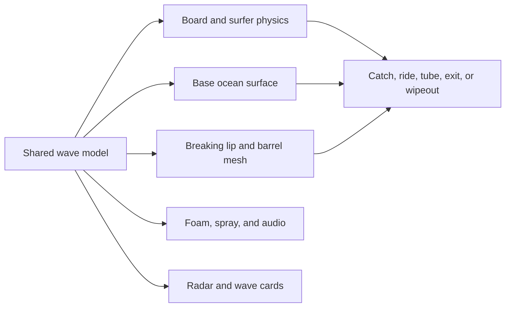

# surf-js complete upgrade plan

Review date: 2026-07-13

Implementation status: the core requested visual upgrade (phases 0–5) is now implemented and under final regression. Phases 6–7 remain the longer-term onboarding, controller, accessibility, and performance roadmap rather than blockers for the character/carry/wave release.

## Current verdict

The game has a strong technical foundation and boots cleanly, but its visual presentation does not yet communicate everything the simulation already knows.

- The start menu uses surfer emoji instead of the procedural in-game riders.
- Kai and Mara differ in code, but their silhouettes are too similar at the real gameplay camera distance.
- The surfboard is positioned beside the rider in world space. No hand, wrist, elbow, or armpit contact drives the pose, so it appears to float.
- The swell, break, hollow-wave prediction, ride scoring, and radar systems are already substantial.
- The visible wave is still primarily one displaced ocean surface. At the default camera, forming waves read as low rolling swells, and the barrel reads as foam or a folded lip instead of an enclosed tube.
- The standard syntax checks, live boot, rider/board selection, PHP leaderboard read, and browser console are currently clean.

The right path is not a restart. Keep the working physics, state machine, radar, backend, and single-file deployment, then rebuild the menu/character presentation and add a dedicated render-only breaking-wave layer around the existing wave model.

## Constraints to preserve

1. Keep `index.php` as the deployable game. Internal sections may be cleaned up, but the project should remain upload-and-run on Bluehost or a Raspberry Pi.
2. Keep the PHP leaderboard/security layer stable unless a planned data migration explicitly requires a change.
3. Preserve JS/GLSL parity for the physical water surface.
4. Keep all art procedural and avoid runtime asset downloads beyond the pinned Three.js modules.
5. Keep the zero-per-frame-allocation rule for gameplay hot paths.
6. Keep rig rebuilds on the start screen unless skeleton bind handling is deliberately redesigned.
7. Preserve low, medium, and high quality tiers.

## Target architecture

The shared wave model remains the authority. The new lip/barrel geometry is a visual representation of the same pocket, break fraction, direction, amplitude, and timing already used by gameplay and the radar.

## Phase 0 — baseline and cleanup harness

Goal: make every later visual change easy to stage, compare, and regression-test.

- Add `window.render_game_to_text()` with mode, player/board/rider state, visible swells, active pocket, ride state, tube state, camera mode, score, and coordinate-system notes.
- Add deterministic `window.advanceTime(ms)` support and a fixed-step test path without changing normal real-time play.
- Add a seeded debug scenario selector for menu, ground carry, lineup, forming face, takeoff, left/right/A-frame break, barrel, and wipeout.
- Keep `PP_DBG`, but expose it only in a debug mode such as `?debug=1` for production hygiene.
- Remove the stale `peelR` compatibility field after confirming nothing consumes it.
- Replace duplicated hard-coded wave constants such as barrel pocket width with generated/injected shared constants.
- Group the existing single-file sections behind clear module-style objects: `WaveModel`, `WaveVisuals`, `RiderFactory`, `BoardFactory`, `PlayerController`, `CameraDirector`, `HUD`, and `TestHooks`.
- Add an `F` fullscreen toggle with resize-safe input mapping.

Acceptance checks:

- PHP and extracted-module syntax checks pass.
- A deterministic scenario produces the same state output and screenshot twice.
- Existing start, selection, ground movement, paddling, sitting, takeoff, surfing, wipeout, pause, and leaderboard flows still work.

## Phase 1 — replace the menu with a live character showcase

Goal: show the real game character and board before the player starts.

- Make the menu background reveal a dedicated Three.js beach/lookout presentation instead of hiding the canvas behind a fully opaque gradient.
- Display the currently selected procedural rider full-body at useful scale, holding the currently selected board.
- Clicking Kai, Mara, or any board immediately rebuilds the live preview with the same factory used in gameplay.
- Add a slow turntable/idle animation and a click-drag preview orbit.
- Keep the selection cards, but replace the emoji as the main identity cue. The real model is the primary preview; cards become clear selectors with name, stance, suit color, and short play-style description.
- Frame the model, board, title, selectors, and start button responsively at 16:9, 16:10, and common laptop sizes.
- Preserve keyboard selection and `localStorage` persistence.

Acceptance checks:

- Kai and Mara are visibly represented by their actual models before starting.
- All six rider/board combinations preview correctly without duplicate meshes, broken materials, or bind-pose drift.
- Selecting a rider or board never changes browser shortcuts such as Cmd/Ctrl+R.
- Menu screenshots remain readable at 1280×720, 1440×900, and 1920×1080.

## Phase 2 — stronger rider identity and model polish

Goal: make Kai read as masculine and Mara read as feminine through silhouette, face, hair, suit design, and movement—not only color.

Kai upgrades:

- Broader shoulder/clavicle line, deeper chest, stronger upper-back taper, thicker neck, forearms, thighs, and calves.
- Squarer jaw/chin, heavier brow, slightly wider nose, and a cleaner short-hair silhouette.
- Suit paneling that reinforces the shoulder/chest shape.
- Slightly heavier idle, walk, paddle, and surf animation timing.

Mara upgrades:

- Narrower shoulder line, clearer waist-to-hip transition, softer jaw/cheek shape, slimmer neck/limbs, and refined ponytail geometry.
- Suit paneling and accent placement that reinforce the silhouette without exaggerated anatomy.
- Lighter idle, walk, paddle, and surf secondary motion.

Shared upgrades:

- Improve hands and feet so they stop reading as mitts/blocks at close menu distance.
- Add clearer elbows, knees, shoulder caps, glutes, and wetsuit collar transitions.
- Tune face scale and eye placement for the new menu close-up while keeping gameplay geometry affordable.
- Keep identical bone names. If limb lengths diverge, move the IK lengths into each rider preset and verify every pose before shipping.
- Increase default gameplay framing slightly so the character remains readable without obscuring the wave.

Acceptance checks:

- Grayscale silhouette tests distinguish Kai and Mara from front, side, and three-quarter views.
- Both riders complete every pose/state without joint pops, collapsed skin, hair detachment, or first-person visibility issues.
- The visual difference remains clear on low quality.

## Phase 3 — real under-arm surfboard carry

Goal: make the board feel physically attached to the rider.

- Add an explicit `poseCarry()` instead of relying on the neutral walk/idle pose.
- Define a board carry socket from rider torso dimensions and board width/thickness.
- Tuck one rail between the torso and upper arm, below the armpit.
- Drive the carrying shoulder, elbow, and wrist with IK targets derived from the board transform.
- Place the hand over or under the rail with a visible wrap, depending on board size.
- Tune nose height, tail clearance, roll, and distance from the hip independently for shortboard, funboard, and log.
- Blend the carry pose with idle, walk, run, and wade motion so contact is preserved while the body moves.
- Add basic sand/water clearance correction so the log does not spear the beach.
- Add a procedural leash from rear ankle to tail after the core carry contact is stable; reuse the pooled verlet/ragdoll math.

Acceptance checks:

- The rail visibly touches the torso/upper arm and the carrying hand touches the board in every ground movement state.
- Wrist-to-grip and rail-to-armpit distances stay within a small tolerance during idle, walk, run, and wade.
- All three boards clear the sand and do not clip through the legs or torso from the normal camera.

## Phase 4 — waves that visibly stand up and break

Goal: make the water view agree with the radar before focusing on full barrels.

- Formalize visual phases for each swell: deep swell, shoaling, stand-up, pitch, peel, collapse, whitewater, and bore.
- Keep `waterH` as the board-physics surface, but compute reusable face data: crest, trough, face normal, steepness, shoulder, pocket, peel edge, and lip throw.
- Increase crest/trough separation and front-face compression only where the wave is shoaling, rather than making the entire ocean sharper.
- Add a darker translucent face, brighter thin crest, visible trough shadow, vertical draw lines, and restrained pre-break feathering.
- Delay broad whitewater coverage until the lip has actually landed so foam does not erase the wave shape.
- Add pooled crest ribbons/spray sheets that travel with the peel instead of relying only on point spray.
- Ease the third-person camera closer to water level when an approaching set is within the readable range; return smoothly after it passes.
- Add an optional lineup camera view without taking control away from the player.
- Tie radar color/ETA to the same visual phase so a purple hollow call corresponds to an unmistakably hollow-looking face.

Acceptance checks:

- From the default lineup camera, a 2–3 ft, 4–5 ft, and 6–8 ft wave can be distinguished without looking at the HUD.
- A forming face, left, right, A-frame, and closeout read correctly in still screenshots and motion.
- Foam never covers the entire face before the break.
- The board follows the same surface the player sees.

## Phase 5 — procedural barrel mesh and tube riding

Goal: create a real visible tube while keeping gameplay and visuals synchronized.

- Add a pooled render-only breaking-wave mesh for every active peel edge.
- Build the mesh as a procedural cross-section swept along the peel direction: face → pitching lip → falling curtain → foam impact zone.
- Render both outside and inside surfaces with correct normals, translucency, thickness, backlighting, and foam along the lip edge.
- Open the tube mouth ahead of the peel edge and close it behind the surfer according to pocket width and break timing.
- Add a darker turquoise barrel-interior grade, sky occlusion, moving caustic bands, curtain droplets, foam ball, and exit light.
- Derive the tube scoring/collision envelope from the same barrel cross-section rather than a separate rectangular test.
- Detect lip/curtain contact for believable wipeouts, while still letting a clean line pass through the opening.
- Add tube-aware chase/inside camera behavior with smooth entry and exit; never hard-snap the camera.
- Synchronize barrel reverb, lip impact, spit spray, HUD, and scoring to actual enclosure.
- Add a visible exit/spit event when the surfer outruns the closing curtain.

Acceptance checks:

- A staged barrel is visibly enclosed from outside, at the mouth, and from the surfer camera.
- The surfer can enter, become enclosed, ride through, and exit into open face.
- Touching the curtain or foam ball causes an understandable wipeout.
- Tube state, 3× scoring, audio, HUD, geometry, and collision enter/exit on the same frames.

## Phase 6 — gameplay, camera, and onboarding polish

Goal: make the upgraded visuals easy to understand and fun to reach.

- Replace the long initial beach crossing with a tighter spawn or a brief optional tutorial route.
- Teach the loop in context: walk/wade → paddle → read set → turn → catch → pop up → trim/pump/stall → exit.
- Add short, state-aware prompts and retire them once the player demonstrates the action.
- Improve camera modes for ground carry, paddling, takeoff, face riding, and barrel riding.
- Add controller support. Treat touch controls as a separate design pass rather than shrinking desktop controls onto a phone.
- Add restart/return-to-menu controls and allow a safe pre-game rider/board reselection flow.
- Add session stats for waves caught, clean takeoffs, longest ride, best barrel, and biggest face. Decide deliberately before migrating leaderboard storage.

Acceptance checks:

- A first-time player can reach and catch a wave without reading the README.
- Every important action has feedback and a recovery path.
- Camera transitions never hide the approaching lip or disorient the player during a ride.

## Phase 7 — performance, accessibility, and release pass

- Profile low/medium/high tiers separately and keep a practical 60 fps target on Apple Silicon at medium.
- Pool every new barrel mesh, ribbon, spray, and leash buffer; update attributes in place.
- Cap the number and resolution of active breaking-wave meshes by quality tier.
- Verify contrast, focus states, keyboard-only menu use, reduced motion, mute state, and readable HUD scaling.
- Add graceful CDN/WebGL failure messages and document offline limitations.
- Re-test PHP 7.4 compatibility, SQLite provisioning, CSRF failure, invalid ride payloads, rate limiting, and leaderboard offline behavior.
- Update `README.md` and `HANDOFF.md` only after features are verified in the running game.

## Implementation order

Do the work in small, independently runnable slices:

1. Test hooks and deterministic visual scenarios.
2. Live menu preview.
3. Rider silhouette/model upgrades.
4. Board carry socket, pose, and IK contact.
5. Forming-wave readability and camera.
6. Breaking lip/curtain mesh.
7. Barrel collision, scoring, camera, audio, and exit.
8. Onboarding, input, performance, accessibility, and documentation.

After each slice: run PHP/JS syntax checks, boot the app, exercise the changed state from start to finish, inspect screenshots at multiple camera angles/quality tiers, check state output, and fix the first new console error before continuing.

## Definition of done

The complete upgrade is done when the start screen shows the real selected surfer and board; Kai and Mara read as distinct characters at gameplay distance; every board is visibly held under an arm with contact-preserving IK; approaching waves stand up and peel clearly from the normal camera; barrels are enclosed procedural geometry that the surfer can enter, ride, and exit; radar, physics, visuals, collision, audio, and scoring remain synchronized; and the single `index.php` deployment still passes its backend, gameplay, visual, and performance checks.
